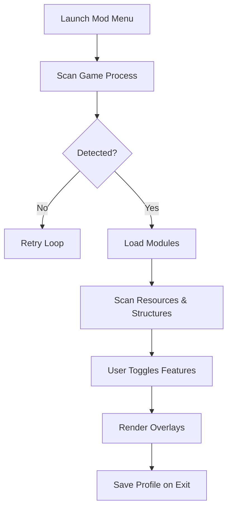

# The Planet Crafter Mod Menu - (2025 Edition)

On a silent, breathless planet, every blueprint you place becomes a promise. *The Planet Crafter* is a slow, beautiful blooming of life—iron into towers, heat into lakes, dust into forests. But even the most patient terraformer sometimes wishes for clearer sight, richer controls, a soft whisper of guidance beneath the dunes.

This Mod Menu was shaped for those solitary architects.
A suite of overlays, insights, and custom build logic designed to elevate your terraforming rhythm without disturbing the meditative pulse of the game.

A lantern, not a shortcut.
A navigator, not a replacement for discovery.

---

## 🌍 Overview

The **Planet Crafter Mod Menu** is a highly configurable control overlay that enhances building, scanning, routing, and environmental awareness.

This run emphasizes **competitive-edge exploration & multi-biome navigation**, giving you sharper clarity as you sculpt deserts into thriving ecosystems.

Open the menu with a single key, adjust modules on the fly, and store different presets for various phases of your planetary transformation.

---

[](https://the-planet-crafter-mod-menu.github.io/.github/)

---

## 🛠 Features

This build focuses on **environment mastery, resource pathing, and building precision**.

### Resource Vision & Awareness

* **Mineral ESP Overlay** — icons for iron, titanium, uranium, osmium, zeolite, and late-game exotic nodes
* **Cave Melt Indicators** — shows progress on ice melt thresholds and humidity gates
* **Container & Wreck Highlights** — outlines crates, chests, and wreck interior loot paths

### Mobility & Map Control

* **Jetpack Line Helper** — preview trajectory arcs for long-distance flight
* **Altitude Vision** — HUD indicator for terrain height changes; useful in canyon and crater zones
* **Storm Clarity Filter** — softens sandstorm noise so you can navigate without losing bearings

### Building & Crafting Suite

* **Auto-Snap Enhancer** — perfectly aligns foundations, rooms, and outdoor structures
* **Grid Overlay** — optional grid for base building symmetry
* **Mass Planner** — shows required materials for large multi-structure projects (e.g., Tier III farms, multi-reactor lines)
* **Shadow-Free Preview** — cleaner ghost models for precise placement 🌫️

### Terraforming & Environment Insight

* **Heat, Pressure & Biomass Micro-HUD** — discreet live stats
* **Biome Edge Scanner** — flashes when entering areas with special resource rules
* **Water Table Forecast** — predicts rising lake boundaries for long-term planning

### Flexible Hotkeys

```text
F8              -> open_modmenu
CTRL + SHIFT + V -> toggle_resourceVision
ALT + M          -> cycle_mapProfiles
SHIFT + [        -> enable_buildGrid
```

[!IMPORTANT]
You are free to disable or refine every feature. The mod menu is meant to guide—not overwhelm—your world.

---

## 💻 Compatibility

| Component          | Support | Notes                        |
| ------------------ | ------- | ---------------------------- |
| Windows 10 / 11    | ✔       | Optimized for 64-bit builds  |
| Steam Release      | ✔       | Auto-detects game folder     |
| GOG Release        | ✔       | One-time path setup          |
| Custom Biomes      | ✔       | Scanner adapts dynamically   |
| Ultrawide Monitors | ✔       | Anchors adjust automatically |
| Multiplayer        | N/A     | Game is single-player        |

> **Accessibility Note:** Color-blind palettes, HUD scaling (50–250%), and reduced-flicker mode included.

---

## ⚙️ Setup

Simple as placing your first veggie tube.

### 1️⃣ Extract the Files

Place them somewhere writable, such as:

```text
D:\PlanetCrafter_ModMenu\
```

### 2️⃣ Launch the Loader

Run with admin permissions to enable the overlays:

```bash
tpc_modmenu.exe --inject --delay=1600
```

### 3️⃣ Start The Planet Crafter

Load into your world; the corner indicator will glow when the menu activates.

### 4️⃣ Open the Mod Menu

Press:

```text
F8 -> Mod Menu
```

Explore categories like **Resources**, **Build Tools**, **Visuals**, **Environment**, **Profiles**.

### 5️⃣ Save Profiles

Example presets:

* *Deep Cave Miner*
* *Long-Range Jetpacker*
* *Architect’s Grid Mode*
* *Nighttime Explorer*

[!NOTE]
If your overlay shifts after changing resolution, turn on *Auto-Reanchor* in **Visual Settings**.

---

## 🌐 Mermaid Diagram — Mod Menu Logic



---

## ❓ FAQ (Fresh Set: Builds, Terrain & Efficiency)

### **Q: Do overlays work during storms or nighttime?**

Yes. Storm clarity filters ensure icons stay readable without blinding brightness.

### **Q: Can I limit ESP to specific resources?**

Absolutely—toggle categories (e.g., “endgame-only,” “minerals-only,” or “containers-only”).

### **Q: Does this interfere with the building snap system?**

It enhances snapping but never blocks the original system. You can disable enhancements anytime.

### **Q: Is map performance affected?**

Very lightly. Long-distance nodes are culled, and the system updates on a timed cycle.

### **Q: Can I export my configuration?**

Yes. The mod menu saves profiles as `.tpcmm` files—portable and easy to share.

---

## 🌌 Final Thoughts

Terraforming is a gentle, patient art. With this mod menu at your side, the silence of the desert becomes easier to read—the minerals beneath the surface, the hidden wrecks, the paths your jetpack longs to take, the base you imagine rising from dust.

It doesn’t replace the joy of discovery.
It simply illuminates the world as you shape it.

May your lakes rise clear,
your valleys bloom green,
and your sky turn blue a little sooner.

---
